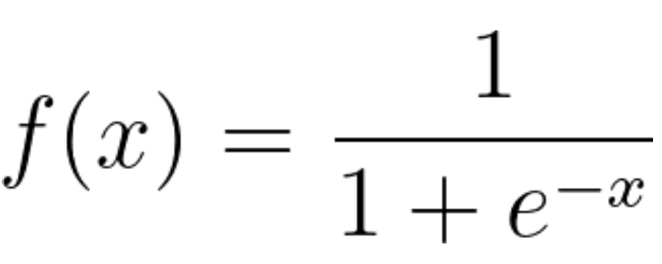

# cardio-vasc-risks

## Contexte du projet

Ce projet consiste au développement d'un outil permettant de poser un diagnostic de risque de maladies cardio-vasculaire. Nous allons mettre en place un algorithme de machine learning de classification binaire, notamment la régression logistique. Pour cela, des données patients nous sont fournies, contenant les caractéristiques suivantes :

- age : âge en nombre de jours (entier)
- height : hauteur en cm (entier)
- weight : poids en kg (entier)
- gender : genre, catégoriel (1 : féminin, 2 : masculin)
- ap_high : tension artérielle systolique (entier)
- ap_low : tension artérielle diastolique (entier)
- cholesterol : taux de cholestérol, catégorique (1 : normal, 2 : au-dessus de la normale, 3 : bien au-dessus de la normale)
- glucose : taux de glucose, catégorique (1 : normal, 2 : au-dessus de la normale, 3 : bien au-dessus de la normale)
- smoke : si patient fume ou non, catégorique (0 : non, 1 : oui)
- alcohol : si le patient boit de l'alcool ou non, catégorique (0 : non, 1 : oui)
- physical_activity : si le patient est actif ou non, catégorique (0 : non, 1 : oui)

et la caractéristique cible : 
- cardio_disease : si le patient a contracté la maladie ou non, catégorique (0 : non, 1 : oui)

## Veille sur la régression logistique

La régression logistique est un algorithme de classification supervisé en machine learning, il permet d'étudier les relations entre un ensemble de variables qualitatives Xi et une variable qualitative Y. Il s'agit d'un modèle linéaire généralisé utilisant une fonction logistique comme fonction de lien. 

Un modèle de régression logistique permet aussi de prédire la probabilité qu'un événement arrive (valeur de 1) ou non (valeur de 0) à partir de l'optimisation des coefficients de régression. Ce résultat varie toujours entre 0 et 1. Lorsque la valeur prédite est supérieure à un seuil, l'événement est susceptible de se produire, alors que lorsque cette valeur est inférieure au même seuil, il ne l'est pas. 

En mathématiques, la fonction logit mappe y en tant que fonction sigmoïde de x.

Si on trace cette équation de régression logistique, on obtient une courbe en S comme illustré ci-dessous.

La fonction logit renvoie uniquement des valeurs comprises entre 0 et 1 pour la variable dépendante, quelles que soient les valeurs de la variable indépendante. C'est ainsi que la régression logistique estime la valeur de la variable dépendante. Les méthodes de régression logistique modélisent également des équations entre plusieurs variables indépendantes et une variable dépendante.

src : 
- https://datascientest.com/regression-logistique-quest-ce-que-cest
- https://aws.amazon.com/fr/what-is/logistic-regression/#:~:text=La%20r%C3%A9gression%20logistique%20est%20un,que%20fonction%20sigmo%C3%AFde%20de%20x.

## Analyse et pré-traitement des données

## Algorithmes utilisés

## Conclusion

